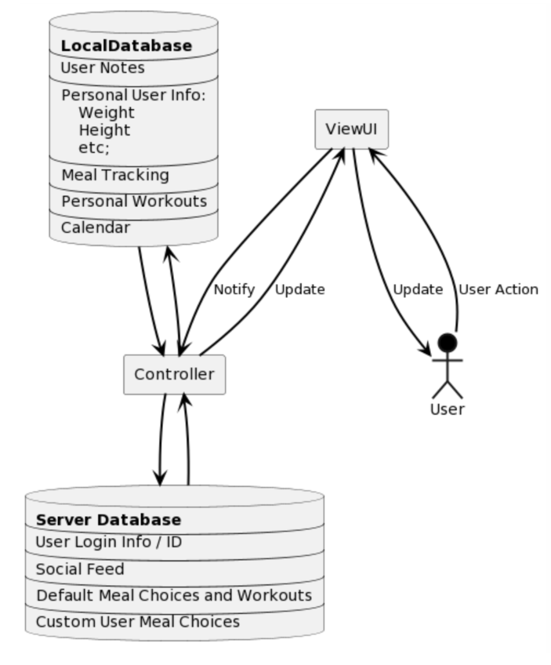
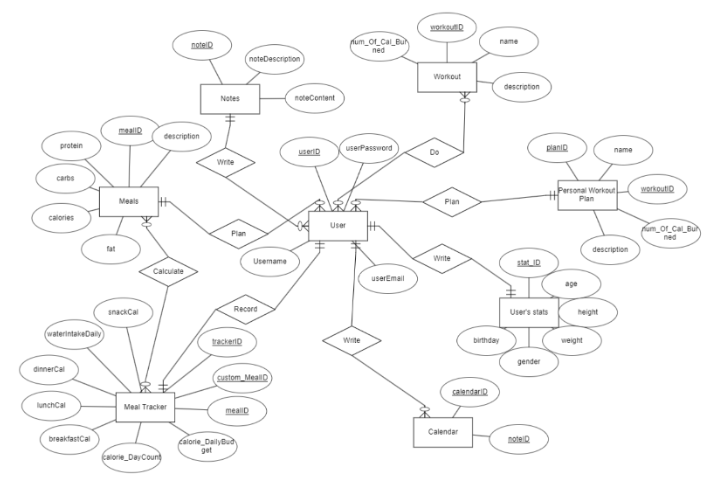
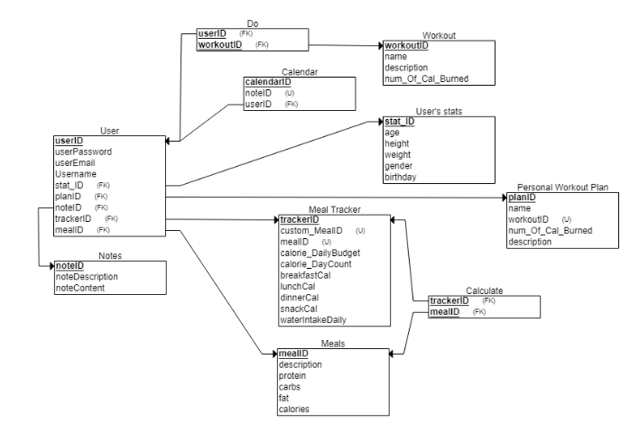
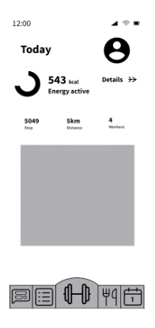
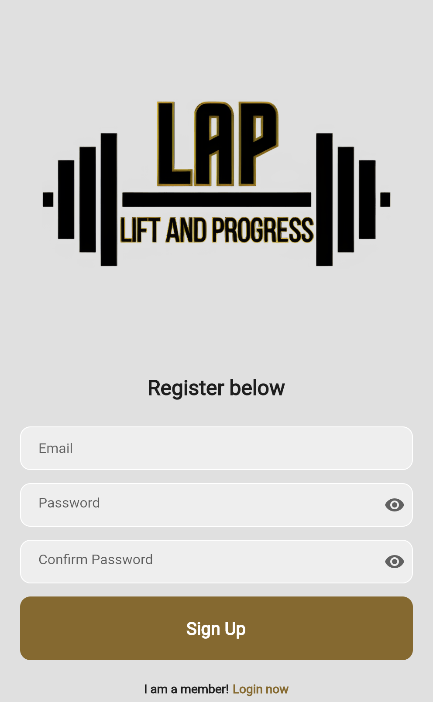
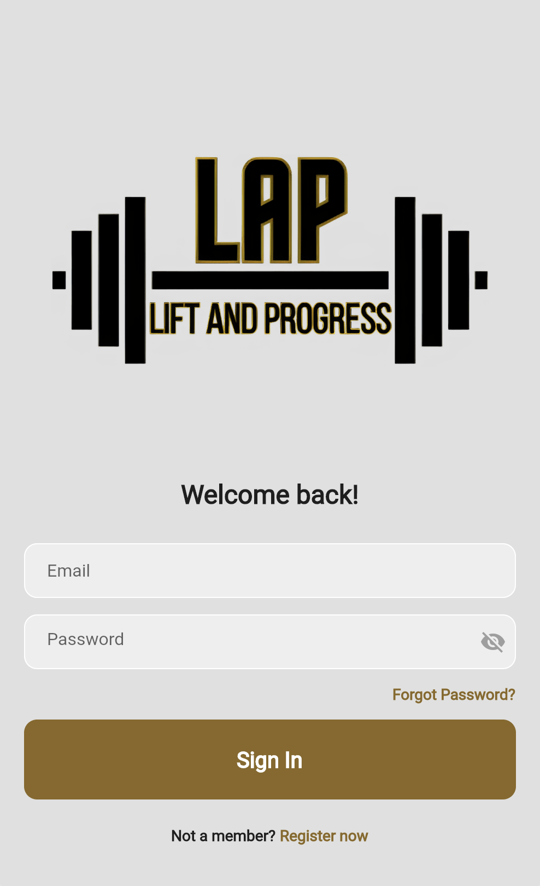
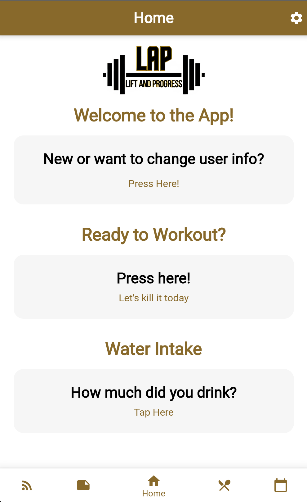

# Developing LAP: Lift and Progress

## The Beginning

Starting with knowledge of developing very simple applications and websites, developing LAP seemed to be no difficult task. My peer [Darrian Yang](https://darrianyang.com) and I decided to work together to develop a health and fitness application for our Software Engineering course that could act as your one stop solution for any and all of your health and fitness needs. Little did we know of what troubles we would face as well as how our final product for the project would differ from our vision.

## Planning Stages

Our first step for this project was deciding what architectural model that we would like to use for our application. We settled on an MVC *(Model-view-controller)* seen below:

*LAP v2.0.0 - MVC Diagram*

We chose to use the MVC architecture due to its flexibility in developing web/mobile applications. We also knew we would want multiple ways to view and interact with data. It allowed for data to change independently of its representation and vice versa such as with a navigation bar.

*LAP v2.0.0 - ERD Diagram*

*LAP v2.0.0 - Relational Schema*

Our next step was to create the database architecture. We started out by creating a large list of what we believed we would need and then shortened it down until we could create a relational schema and an ERD (*entity relationship diagram*).

*LAP v2.0.0 - Wireframe of Home Screen*

As we were working on the database design, we also started working on a wireframe of what we would like the application to look like. Although our application did not end up looking exactly like this, we strived to achieve this design.

## Development and Final Product

Throughout working on this project we ran into many challenges that we overcame. Whether it was a group member who was uncommunicative to issues with gaps of knowledge, we were able to persevere and finish the project.

Seen below are some screen captures of the application in its final state at the end of the semester.

*LAP v2.0.0 - Register Page*

*LAP v2.0.0 - Login page*

*LAP v2.0.0 - Home Page*

# From School Project to Application

During the remaining school semesters we had, Darrian Yang and I decided to further our development of this application as well as our software engineering skills. In our free time we contribute to the repository to create a more finished, secure, and official version of the application.